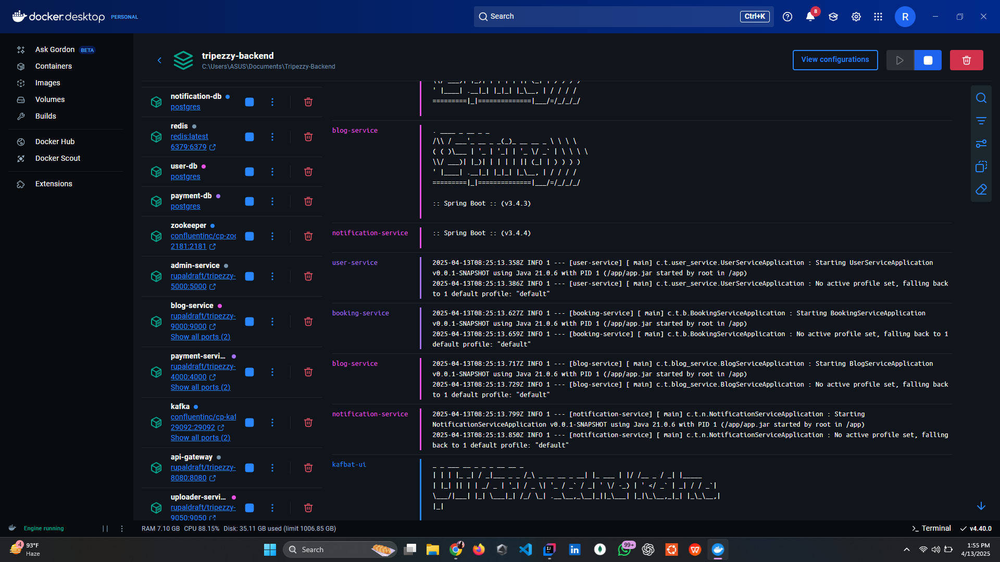
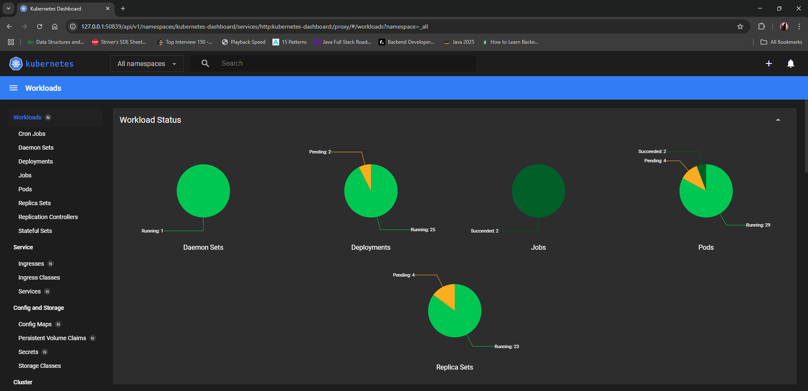
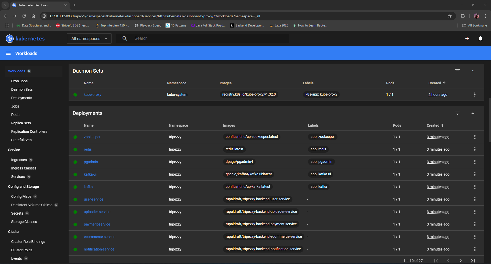
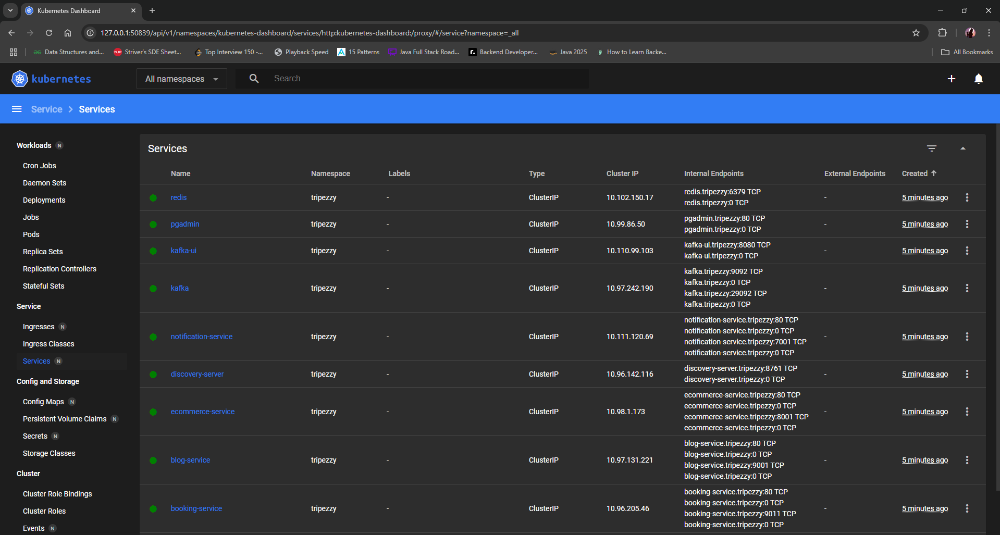
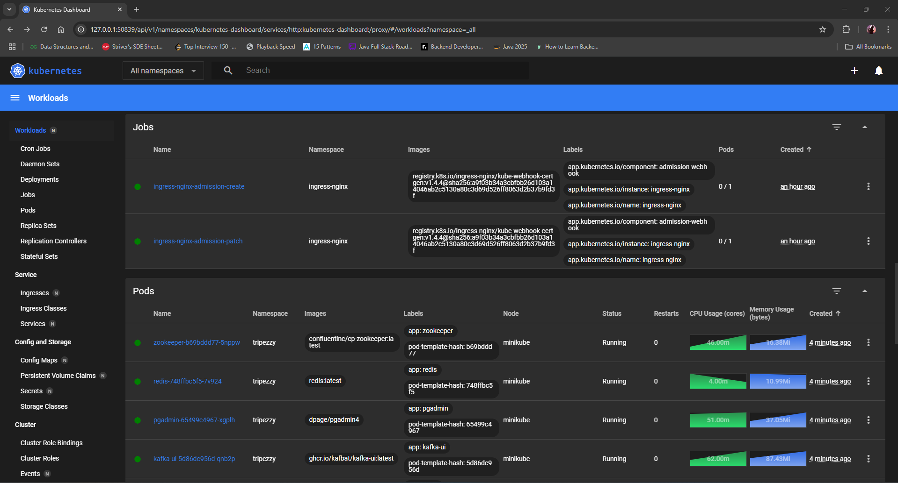

## Microservice Design


# Tripezzy - Root Project

This document provides an overview of the Tripezzy project, a platform for travel and tourism services, and describes the various microservices that comprise the application.

## Project Description

Tripezzy is a microservices-based platform designed to facilitate travel and tourism-related activities. It offers a range of functionalities, including blog management, booking services, user authentication, e-commerce features, and more. The platform is built using Spring Boot and leverages various technologies like Spring Cloud, Eureka, and Kafka.

## Microservices Overview

The Tripezzy project is composed of the following microservices:

### 1. Discovery Server (`eureka-server`)

* **Description**: The Discovery Server, built using Netflix Eureka, enables service registration and discovery. Microservices register themselves with Eureka, and other services can query Eureka to discover the registered services' locations. This facilitates dynamic service discovery and load balancing.
* **Key Features**:
    * Service registration
    * Service discovery
    * Health checks
    * Dynamic service location
* [Link to Eureka Server README](./discovery-server/README.md) (Note: You'll need to create this README)

### 2. API Gateway Service (`api-gateway-service`)

* **Description:** The API Gateway service acts as the entry point for all client requests, routing them to the appropriate microservice. It also handles authentication and other cross-cutting concerns.
* **Key Features:**
    * Request Routing
    * Load Balancing (with Eureka)
    * Authentication (JWT)
    * Centralized Configuration
* [Link to API Gateway README](./api-gateway-service/README.md)

### 3. User Service (`user-service`)

* **Description:** The User service manages user-related operations, including authentication, registration, and user profile management.
* **Key Features:**
    * User Authentication and Authorization
    * User Registration
    * User Profile Management
    * Seller and Guide Onboarding
* [Link to User Service README](./user-service/README.md)

### 4. Ecommerce Service (`ecommerce-service`)
* **Description:** The E-commerce service handles product catalog, shopping cart, and wishlist functionalities.
* **Key Features:**
    * Product Management
    * Cart Management
    * Wishlist Management
* [Link to E-commerce Service README](./ecommerce-service/README.md)

### 5. Admin Service (`admin-service`)

* **Description:** The Admin service provides functionalities for managing destinations and tour packages.
* **Key Features:**
    * Destination Management
    * Tour Management
* [Link to Admin Service README](./admin-service/README.md)

### 6. Payment Service (`payment-service`)
* **Description:** Handles payment transactions.
* **Key Features**
    * Processes payments using Stripe
    * Retrieves payment records
* [Link to Payment Service README](./payment-service/README.md)

### 7. Blog Service (`blog-service`)

* **Description:** The Blog service manages blog posts and related interactions.
* **Key Features:**
    * Blog Post Management
    * Blog Post Search and Filtering
    * Likes and Comments
* [Link to Blog Service README](./blog-service/README.md)

### 8. Booking Service (`booking-service`)

* **Description:** The Booking service handles booking operations for travel and tourism services.
* **Key Features:**
    * Booking Management
    * Booking Retrieval and Filtering
    * Booking Cancellation and Confirmation
* [Link to Booking Service README](./booking-service/README.md)

### 9. Notification Service (`notification-service`)
* **Description:** The Notification service manages user notifications, consuming events from other services via Kafka.
* **Key Features:**
    * Retrieve User Notifications
    * Kafka Consumer (new blog, blog likes/comments, new bookings, booking status updates, product checkouts)
    * Database storage of notifications
* [Link to Notification Service README](./notification-service/README.md)

### 10. Uploader Service (`uploader-service`)
* **Description:** Handles file uploads to and deletions from Cloudinary.
* **Key Features:**
    * File Upload to Cloudinary
    * File Deletion from Cloudinary
    * Rate Limiting
* [Link to Uploader Service README](./uploader-service/README.md)

## Getting Started

To get started with the Tripezzy project, follow these general steps:

1.  **Clone the repository:**

    ```bash
    git clone https://github.com/rupal-draft/Tripezzy-Backend.git
    ```

2.  **Build the project:**

    ```bash
    ./mvnw clean install
    ```

3.  **Run the application:**

    * Start the Eureka server.
    * Start each microservice individually.

4.  **Configure environment variables:**

    * Set the necessary environment variables for each service, including database credentials, Kafka broker details, Cloudinary credentials, and JWT secret keys.

## Documentation

Each microservice has its own README.md file with detailed information about its specific functionality, API endpoints, and configuration. Please refer to the individual README files for more details.


## gRPC Setup
Add the following to the `<dependencies>` section
```xml
<!--GRPC -->
<dependency>
    <groupId>io.grpc</groupId>
    <artifactId>grpc-netty-shaded</artifactId>
    <version>1.69.0</version>
</dependency>
<dependency>
    <groupId>io.grpc</groupId>
    <artifactId>grpc-protobuf</artifactId>
    <version>1.69.0</version>
</dependency>
<dependency>
    <groupId>io.grpc</groupId>
    <artifactId>grpc-stub</artifactId>
    <version>1.69.0</version>
</dependency>
<dependency> <!-- necessary for Java 9+ -->
    <groupId>org.apache.tomcat</groupId>
    <artifactId>annotations-api</artifactId>
    <version>6.0.53</version>
    <scope>provided</scope>
</dependency>
<dependency>
    <groupId>net.devh</groupId>
    <artifactId>grpc-spring-boot-starter</artifactId>
    <version>3.1.0.RELEASE</version>
</dependency>
<dependency>
    <groupId>com.google.protobuf</groupId>
    <artifactId>protobuf-java</artifactId>
    <version>4.29.1</version>
</dependency>
    
```

Replace the `<build>` section with the following

```xml

<build>
    <extensions>
        <!-- Ensure OS compatibility for protoc -->
        <extension>
            <groupId>kr.motd.maven</groupId>
            <artifactId>os-maven-plugin</artifactId>
            <version>1.7.0</version>
        </extension>
    </extensions>
    <plugins>
        <!-- Spring boot / maven  -->
        <plugin>
            <groupId>org.springframework.boot</groupId>
            <artifactId>spring-boot-maven-plugin</artifactId>
        </plugin>

        <!-- PROTO -->
        <plugin>
            <groupId>org.xolstice.maven.plugins</groupId>
            <artifactId>protobuf-maven-plugin</artifactId>
            <version>0.6.1</version>
            <configuration>
                <protocArtifact>com.google.protobuf:protoc:3.25.5:exe:${os.detected.classifier}</protocArtifact>
                <pluginId>grpc-java</pluginId>
                <pluginArtifact>io.grpc:protoc-gen-grpc-java:1.68.1:exe:${os.detected.classifier}</pluginArtifact>
            </configuration>
            <executions>
                <execution>
                    <goals>
                        <goal>compile</goal>
                        <goal>compile-custom</goal>
                    </goals>
                </execution>
            </executions>
        </plugin>
    </plugins>
</build>
```

## DockerFile Setup

```Dockerfile
FROM maven:3.9.9-eclipse-temurin-21-jammy AS build
WORKDIR /app
COPY .mvn/ .mvn
COPY mvnw pom.xml ./
RUN ./mvnw dependency:go-offline
COPY src ./src
RUN ./mvnw clean package -DskipTests

FROM eclipse-temurin:21-alpine
WORKDIR /app
COPY --from=build /app/target/*.jar app.jar
EXPOSE 6000 6001
CMD ["java", "-jar", "app.jar"]
```

## 🛠️ Build Docker Images
For each microservice, use:

```bash
docker build -t your-dockerhub-username/project-name/service-name ./service-name
```

## 🧩 Docker Compose Setup

```yaml
services:
  zookeeper:
    image: confluentinc/cp-zookeeper:latest
    ports:
      - 2181:2181

  kafka:
    image: confluentinc/cp-kafka:latest
    ports:
      - 9092:9092
      - 29092:29092
    depends_on:
      - zookeeper
    environment:
      KAFKA_ZOOKEEPER_CONNECT: zookeeper:2181
      KAFKA_ADVERTISED_LISTENERS: PLAINTEXT://kafka:9092,PLAINTEXT_HOST://localhost:29092

  redis:
    image: redis:latest
    ports:
      - "6379:6379"

  booking-service:
    image: your-username/booking-service
    ports:
      - "9010:9010"
      - "9011:9011"
    env_file:
      - ./booking-service/.env
```

Run all containers:
```bash
docker-compose up --build
```



## ☸️ Kubernetes Setup (Minikube)
🧱 Start Minikube
```bash
minikube start --memory=4096 --cpus=2 --driver=docker
```

🗂️ Namespace
```bash
kubectl create namespace tripezzy
```

🔐 Load Secrets for Each Microservice
```bash
for d in *-service; do
  kubectl create secret generic $d-secret --from-env-file=./$d/.env -n tripezzy
done
```

🚀 Apply Deployments & Services
```bash
kubectl apply -f k8s/ --recursive --namespace=tripezzy
```

🌐 Enable Ingress
```bash
minikube addons enable ingress
```

📊 Kubernetes Dashboard
```bash
minikube dashboard
```
### 📂 Sample Kubernetes Deployment

```yaml
apiVersion: apps/v1
kind: Deployment
metadata:
  name: booking-service
  namespace: tripezzy
spec:
  replicas: 1
  selector:
    matchLabels:
      app: booking-service
  template:
    metadata:
      labels:
        app: booking-service
    spec:
      containers:
        - name: booking-service
          image: your-user/booking-service
          ports:
            - containerPort: 9010
            - containerPort: 9011
          envFrom:
            - secretRef:
                name: booking-service-secret
```

### 📂 Sample Kubernetes Service

```yaml
apiVersion: v1
kind: Service
metadata:
  name: service-name
  namespace: tripezzy
spec:
  selector:
    app: service-name
  ports:
    - name: http
      protocol: TCP
      port: 9010        # Port exposed by the service
      targetPort: 9010  # Port inside the container

    - name: grpc
      protocol: TCP
      port: 9011        # gRPC port exposed by the service
      targetPort: 9011  # gRPC port inside the container

  type: ClusterIP       # Use "NodePort" for local dev, or "LoadBalancer"/"Ingress" with Minikube
```

## 📊 Kubernetes Dashboard Overview

Explore the powerful and intuitive Kubernetes Dashboard UI used in the **Tripezzy** project. It gives you a real-time visual of everything happening inside the cluster—from deployments to services to pods and jobs!

---

### 🔍 Cluster Metrics


---

### 📦 Deployments


---

### 🌐 Services


---

### 🧱 Jobs & Pods


---

### 📊 Replica Sets


